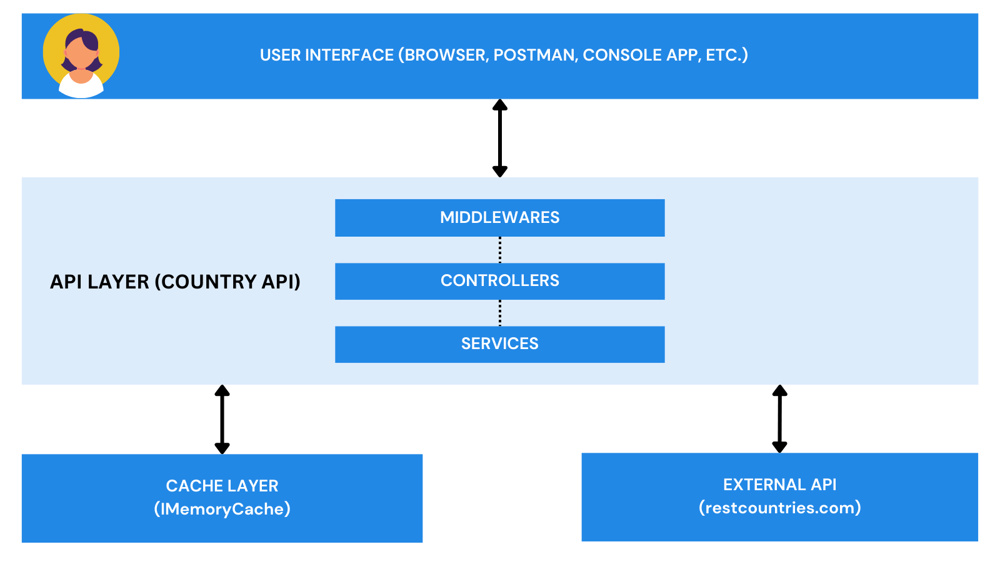

# Country API - Project Overview
Welcome to the CountryAPI project, a solution designed to provide detailed information about countries, regions, and languages. This project shows how you can use modern .NET technologies, infrastructure as code, and CI/CD to build and deploy scalable applications.

- App URL - `https://countryapi-adora.azurewebsites.net/`
- Swagger URL - `https://countryapi-adora.azurewebsites.net/swagger`

## Project Structure

### 1. `/.github/workflows`
This directory contains the pipeline YAML files, which define the CI/CD workflows. These pipelines automate the build, test, and deployment processes, so that we can have a consistent and reliable release cycle.

### 2. `/src`
This directory houses the core of the project, structured as a C# solution with three main projects:

- **CountryAPI:** The primary API service, built using ASP.NET Core. It offers endpoints to retrieve information about countries, regions, and languages, with features like caching, error handling, and optional data sorting and filtering.

- **Country API Tests:** A suite of tests for the CountryAPI using xUnit and Moq. These tests ensure the reliability and correctness of the API functionalities.

- **Country API Simulator:** A console application designed to simulate load by making up to 10,000 asynchronous calls to each API endpoint. This tool helps in stress testing the API and ensuring its robustness under heavy load. **(Note that if you want to call this simulator, you an use your local url or deploy it to your own cloud instance. Calling the Azure URL for this project will max out the Quota because the app service plan hosting this project is the free tier.)**

For detailed setup instructions, please refer to the [SETUP.md](src/SETUP.md) file, which guides you through the process of setting up the API locally.

### 3. `/infra`
This directory contains Azure Bicep scripts for creating and managing the infrastructure needed to host the CountryAPI. The scripts facilitate the automated provisioning of cloud resources, and this helps us create a scalable and secure deployment environment.

## Architecture
This application has multiple components that interact with eachother (as shown in the image below):

To see a detailed description of the architecture, you can click [here](./Architecture.md).

## Approach and Implementation
The project was designed with a focus on scalability, robustness, and ease of use. I utilized ASP.NET Core's powerful features, such as dependency injection, memory caching, and object oriented programming principles, to build a performant API. The infrastructure setup using Azure Bicep scripts reflects a cloud-first approach, since this API was built and deployed to Azure App Service.

To see more about the implementation, you can checkout the [architecture file](./Architecture.md). It has the list of components created and how they interact with each other (They were moved to a different page so that this is easier to read).

## Highlights I found interesting:
- **Comprehensive Caching Strategy:** Implemented using `IMemoryCache` with configurable settings, enhancing performance by reducing redundant API calls. Before choosing this approach, I considered using a JSON file to store the retrieved data. The goal was to avoid integrating an external service like Redis. However, using a JSON file would have been slower because it involves file I/O operations—reading from and writing to disk—which are generally slower than accessing data from memory. Ultimately, `IMemoryCache was` chosen for its speed and simplicity, allowing for quick data access and reducing the load on the external API. This approach also provided an easy way to manage and configure cache settings, such as expiration times, within the application's lifecycle.
- **Error Handling:** I implemented methods to validate data and handle exceptions in a way that provides meaningful error messages to API consumers. This involved checking for common issues, such as missing or malformed data, and catching exceptions that could occur during the processing of requests. By doing this, the API can inform users about specific problems in their requests, helping them understand what went wrong and how to fix it. Additionally, this approach improves the overall user experience by preventing generic error messages and ensuring that the API behaves predictably even when unexpected issues arise. This focus on detailed error handling also aids in troubleshooting and maintaining the application, as it provides clear logs and error reports for developers to diagnose and address issues promptly.
- **Automated CI/CD:** As someone who values infrastructure as code and DevOps practices, this was my biggest highlight. I created YAML-based workflows in GitHub Actions to automate testing and deployment, ensuring that changes to the codebase are consistently built, tested, and deployed without manual intervention. Additionally, I wrote Bicep code to define and provision the Azure infrastructure needed for the CountryAPI.
- **Middleware:** When building this, I was particular about the experience of whoever will use this API, so showing the right success/error messages across every area was important to me. A highlight for me was using middleware to handle specific tasks globally, such as returning a standard JSON response for 404 errors. This middleware provides users with a clear message when they navigate to an incorrect URL, including a list of valid endpoints and a link to the API documentation. This feature enhances the user experience by guiding them to the correct resources and reducing confusion. Additionally, it simplifies the maintenance and extension of the API by centralizing error handling logic, making it easier to manage and update. 

## What I'm Proud Of
I'm particularly proud of the project's testing strategy. This ensures that the API is reliable and performs the same way everytime. I also like the fact that the simulator checked for high-load scenarios by validating the API's performance under stress (10,000 simulataneous calls for each endpoint).

## Potential Improvements
Given more time, I would focus on the following enhancements to further improve the CountryAPI project:

- **Advanced Caching Mechanisms:** While `IMemoryCache` is a simple and effective caching solution for our usecase, it is limited to a single instance of the application and does not scale well in a distributed environment. Implementing distributed caching solutions like Redis would allow the application to scale across multiple instances while maintaining a consistent cache state. Redis also has advanced features such as data persistence, eviction policies, and support for complex data types, which could further enhance the performance and reliability of the API.

- **Rate Limiting:** Since it's an application that anyone can access, to protect the API from abuse and potential Distributed Denial of Service (DDoS) attacks, implementing rate limiting would be essential. Rate limiting controls the number of requests a user or IP address can make to the API within a given timeframe. This would help ensure that the API remains available and responsive for all users, preventing any single user from consuming excessive resources. Integration with rate limiting tools on Azure would be helpful here.

- **Enhanced Logging and Monitoring:** Currently, basic logging is in place to capture exceptions and operational metrics. However, integrating more sophisticated logging and monitoring tools, such as Azure Monitor or the ELK stack (Elasticsearch, Logstash, Kibana), would provide deeper insights into the application's performance. These tools could help track key metrics like request rates, response times, error rates, and resource usage.
